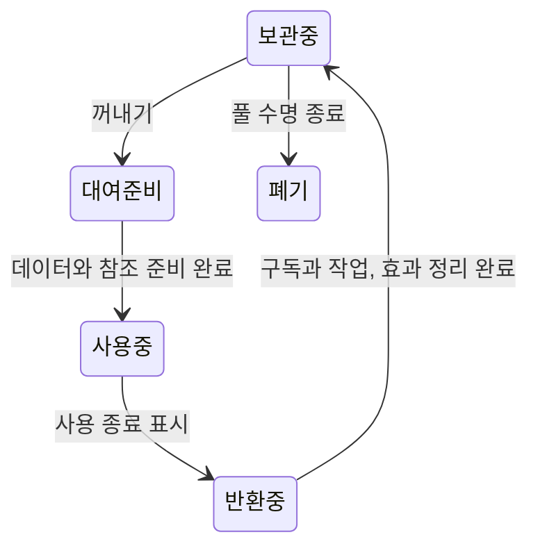

# 기본 아키텍처 — 확정 기준

상태: **사용자 기준 확정 / 세부 설계·아키텍처 제작 진행 중**. 결정일: 2026-09-08. Observable·LoopDispatcher에 이어 VContainer와 게임 시간·UI Pause를 연결했고 현재 씬 Play Mode 검사 25개를 통과했다. Pool 기반은 R-018의 독립 ObView/선택적 IPoolable로 수정해 Play Mode 66개를 통과했다. 전체 기반은 미완성이며 단위별 실행 결과는 REVIEW에 남긴다.

출처: Daniel이 “내가 만드는 게임들은 대부분 아래 설명한 아키텍처 기반으로 작동해”라고 제시한 1–8번과 “문서에 기록하여 다음부터 질문하지 않도록” 요청한 메시지, 이후 “추가로 나는 DI 의존성 주입으로 코드 작성을 해”라는 추가 기준과 “Code Stripping을 High로 하기 때문에 관리도 해야해”라는 후속 기준. 이 문서는 해당 기준의 단일 원본이다.

## 다음 작업에서 적용할 규칙

- 아래 10가지는 AI 제안이나 승인 대기 항목이 아니다. **이미 정한 기본값으로 적용하고 같은 선택을 다시 묻지 않는다.**
- 현재 순서는 아키텍처 정제 → 합의한 아키텍처 제작 → A안 플레이 기능 제작이다. 작은 기능을 먼저 만들기 위해 이 순서를 건너뛰지 않는다.
- 사용자가 바꾸겠다고 하지 않는 한 기준을 유지한다. 현 구현과 충돌하면 구체적인 충돌 지점만 설명하고 그 부분을 함께 다듬는다.
- 구현 여부와 기준 채택 여부를 구분한다. 코드가 빈 골격이거나 패키지가 아직 없다는 이유로 이 기준의 채택을 재질문하지 않는다.
- R-019: ProjectTemplate의 MVC는 설계 의도를 확인하는 참고다. 현재 프로젝트에 필요한 책임부터 간소화해 단계적으로 연결하며, 참고 전체를 같은 상속·모듈 구조로 복제하지 않는다.

## 10개 확정 기준

| ID | 사용자 기준 | 설계·리뷰에 적용할 내용 |
|---|---|---|
| A-01 | 단일 책임 원칙과 작은 파츠 | 하나의 스크립트에 전체 기능을 몰아넣지 않는다. 각 부분의 책임을 작게 나누고 조합한다. |
| A-02 | 중앙 UpdateLoop | 게임 시간을 중앙에서 관리하고 Update·Fixed·Late 등의 Loop 이벤트를 발행한다. 각 대상은 필요한 이벤트를 구독해 동작한다. |
| A-03 | 월드 오브젝트는 MVC | 월드 오브젝트의 Model·View·Controller 역할을 분리한다. 구체적인 상태 소유와 참조 방향은 기존 구조를 바탕으로 다듬는다. |
| A-04 | UI 객체는 MVP | UI의 Model·View·Presenter 역할을 분리한다. 화면 처리에 월드 MVC를 일괄 적용하지 않는다. |
| A-05 | Pool + Factory + Observer | 오브젝트는 Pool에서 제공하고 생성에 Factory, 관찰·통지에 Observer 패턴을 적용한다. 대여·반환·정리 시 Tween, 활성 상태 등 초기화와 파티클 정리를 필수로 다룬다. |
| A-06 | Zero Alloc 지향 | UniTask, TMP의 text.SetText 등을 사용한다. 반복 실행 구간에서 불필요한 할당을 줄이며 실제 할당량으로 확인한다. |
| A-07 | ScriptableObject 활용 | SO를 아키텍처의 데이터 자산으로 활용한다. 구체적인 용도·스키마·런타임 변경 정책은 세부 설계에서 정한다. |
| A-08 | Addressables 메모리 관리 | Addressables를 활용해 리소스 수명과 메모리를 관리한다. Pool의 오브젝트 수명과 로드 자산의 수명·해제 책임을 연결한다. |
| A-09 | DI 의존성 주입 | 필요한 의존성을 외부에서 주입받도록 코드를 작성한다. 객체의 역할과 의존 관계를 명확히 드러내며, 이 방식을 기본 아키텍처에 적용한다. |
| A-10 | High Code Stripping 대응 | Managed Stripping Level High를 전제로 설계한다. DI·리플렉션·동적 생성/로딩에 필요한 타입과 멤버의 보존을 관리하고, 실제 대상 Player 빌드에서 동작을 검증한다. |

## 초기화·정리에서 검토할 상황

아래는 A-02·A-05·A-06·A-08을 구현할 때 확인할 항목이다. 특정 인터페이스명이나 호출 순서를 이미 확정했다는 뜻은 아니다.

- 풀에서 다시 꺼낸 객체가 이전 위치·활성 상태·게임 상태를 잘못 이어받지 않는가.
- 반환된 객체의 Tween이나 완료 콜백이 다음 대여 상태를 건드리지 않는가.
- 파티클과 필요한 하위 효과가 반환·정리 후 남지 않는가.
- Loop·Observer 구독이 대여마다 중복되거나 반환 뒤 계속 호출되지 않는가.
- 이전 사용의 비동기 작업이 반환·재사용 후 완료되어 새 상태를 덮지 않는가.
- 사용 중인 객체 또는 풀에 보관된 객체가 필요한 Addressables 자산을 너무 일찍 해제하지 않는가. 풀 자체를 정리할 때 로드 참조가 누락되지 않는가.

## 확정하지 않은 세부 설계

채택 여부를 다시 묻지 않고, 실제 구현에 필요한 세부 계약만 순서대로 다듬는다. 지금 한 번에 모두 답해야 하는 질문 목록이 아니다.

- 게임 일시정지·UI 시간은 아래 R-013 계약으로 확정했다. Observer의 발행 중 구독 변경 처리는 PLAN의 현재 구현 계약을 따른다.
- MVC/MVP의 생성·연결·해제 책임과 참조 방향.
- DI는 설치된 VContainer 1.19.0과 현재 씬 GameLifetimeScope를 사용한다. Pool 재사용·자산 해제와 스코프의 연결은 후속 세부 설계다.
- Pool의 대여·반환·폐기 단계와 Tween·파티클·비동기 작업·구독의 정리 책임.
- SO의 용도와 런타임 상태 보관 범위.
- Addressables 로드 핸들 소유자, 풀과의 수명 관계, 오류·취소·최종 해제 처리.

## High Stripping 관리 기준

[DECISION:user / A-10] High를 기본으로 적용하며 사용 여부를 다시 묻지 않는다. 오류를 가리기 위해 Stripping 수준을 임의로 낮추지 않는다.

- DI가 리플렉션으로 찾는 생성자·주입 멤버, 동적으로 생성하는 타입 등 정적 분석에서 사용이 드러나지 않는 경로를 확인한다. 사용하는 DI 도구가 정해지면 해당 도구의 코드 생성·보존 지원을 함께 확인한다.
- 필요한 범위에 `UnityEngine.Scripting.Preserve` 또는 `link.xml`을 적용한다. 어셈블리 전체 보존을 기본값으로 두지 않고 대상·보존 이유·확인 경로를 기록한다.
- 타입에 `[Preserve]`를 붙였다고 모든 멤버가 보존된다고 가정하지 않는다. 필요한 생성자·메서드·필드의 실제 보존 범위를 확인한다. [Unity 코드 보존 문서](https://docs.unity3d.com/6000.3/Documentation/Manual/managed-code-stripping-preserving.html)
- Factory 등록, DI 구성, Addressables 콘텐츠나 리플렉션 사용 경로가 바뀌면 기존 보존 규칙이 충분한지 검토한다. 패턴이나 패키지 이름만 보고 보존 완료로 판단하지 않는다.
- 대상 플랫폼·Scripting Backend·High 설정을 기록한 Player 빌드에서 시작 시 DI 구성, 객체 생성·풀 재사용, 사용 중인 동적 콘텐츠 로드와 콜백 경로를 실행한다. Editor/Play Mode 통과만으로 Stripping 대응을 완료 처리하지 않는다. [Unity High 설정과 검증 지침](https://docs.unity3d.com/6000.3/Documentation/Manual/managed-code-stripping-configure.html)
- IL2CPP를 사용하는 대상에서는 제네릭 AOT 코드 생성 문제와 제거된 코드의 보존 문제를 구분한다. 보존 어노테이션만으로 모든 AOT 경로가 해결됐다고 기록하지 않는다.

현재 GameFlow·UpdateLoop·ScreenPauseScope의 주입 메서드에 `[Inject, UnityEngine.Scripting.Preserve]`를 적용했다. GameClock·LoopDispatcher·UnityGameTime은 명시적 생성 factory로 등록해 생성 경로를 드러낸다. 어셈블리 전체 보존이나 `link.xml`은 추가하지 않았다. 실제 High Player 빌드·IL2CPP/AOT 검증은 미실행이며 이 소스 조치만으로 대응 완료라 하지 않는다.

## VContainer와 UI Pause 계약 — R-013

[DECISION:user] Daniel이 VContainer 설치를 완료했다. UI에는 별도 시간 관리자를 만들지 않고 게임 시간과 분리하며, 열려 있는 동안 게임을 Pause한다. 같은 선택을 재질문하지 않는다.

[DECISION:agent / W-000-DI-PAUSE-001] 현재 단일 게임 씬의 조립 위치는 기존 WorldObjects에 붙는 `GameLifetimeScope`다. UI 루트 참조는 기존 UI(HUD)를 가리키고 그 자식에 주입한다. 이후 동적으로 만든 UI는 Factory에서 주입한 뒤 사용해야 한다. 기존 WorldObjects·UI 배치와 Inspector 수동값을 우선한다.

| 부분 | 하나의 책임 |
|---|---|
| `GameLifetimeScope` | VContainer 등록·기존 컴포넌트/UI 주입·씬 서비스 소유 |
| `GameFlow` | 게임 시작·중단 의도 |
| `GameClock` / `IGamePause` | 요청 배율·실행 의도·UI별 Pause 소유자 관리 |
| `UnityGameTime` | 유효 배율을 Unity timeScale에 적용하고 scope 종료 시 이전 값 복원 |
| `UpdateLoop` → `LoopDispatcher` → `ILoopEvents` | Unity 프레임을 받아 필요한 구독자에 전달 |
| `ScreenPauseScope` | 화면 루트 활성화/비활성화·파괴와 Pause 요청 수명 연결 |

- 열린 화면마다 자신의 Pause 요청을 보유한다. 같은 화면의 중복 요청은 한 번으로 취급한다. 둘 중 하나만 닫으면 계속 Pause이며 마지막 화면을 닫으면 보관한 요청 배율로 돌아간다.
- 게임 Stop과 UI Pause는 별개다. 게임을 중단한 뒤 UI를 닫아도 Start를 대신 호출하지 않는다. Pause 중 배율을 바꿔도 0을 유지하고 재개 시 새 요청 배율을 적용한다.
- `ScreenPauseScope`는 실제 여닫는 화면 루트에 붙인다. 현재 비어 있는 상시 HUD Canvas에는 자동으로 붙이지 않는다. 화면을 SetActive로 열고 닫으면 요청을 획득·해제하며, 파괴 시에도 해제한다. CanvasGroup만 숨기는 화면은 이후 Presenter에서 동일 수명을 연결해야 한다.
- UI의 새 Clock/Loop는 없다. UI 입력·표시는 게임 Loop 구독에 의존시키지 않는다. 물리와 게임 연출은 scaled time을 사용한다. 게임 Tween의 independent update나 ParticleSystem의 useUnscaledTime을 켜면 이 Pause 계약 밖에서 계속 움직이므로 게임 효과에는 적용하지 않는다.
- `fixedDeltaTime`은 기존 값을 유지해 물리의 게임 시간 기준 고정 간격을 보존한다. UpdateLoop에는 이미 scaled된 delta를 넘긴다. [Unity timeScale](https://docs.unity3d.com/6000.3/Documentation/ScriptReference/Time-timeScale.html)
- UpdateLoop 컴포넌트 비활성화는 전달기만 멈추고 GameFlow의 실행 의도를 지우지 않는다. 재활성화 시 현재 clock 상태를 따라 전달을 복구한다. 게임 자체의 Stop은 GameFlow/명시적 StopLoop가 담당한다.
- GameClock은 메인 스레드 동기 상태다. StateChanged 예외는 상태 변경 후 호출자에게 전파한다. 핸들러는 예외를 던지지 않아야 하며 이후 핸들러 실행까지 보장하는 fault isolation은 제공하지 않는다.
- 지금은 단일 GameLifetimeScope가 Unity 전역 시간을 소유한다. 여러 게임 scope를 가산 로드하거나 전역 시간 소유자를 추가할 때는 수명 계약을 다시 설계한다. 화면 여러 개를 열기 위해 새 게임 scope를 만들지 않는다.

## Pool/Factory 수명 계약 — R-015·R-016

상태: **사용자 계약 반영 / W-000-POOL-001 기반 구현·Play Mode 66개 검사 통과**. 최초 조사는 빈 Pool/MVC 골격을 기준으로 했고, R-018까지 반영한 최종 구현을 검증했다. 실제 Ball MVC·Addressables 연결은 후속이다.

[DECISION:user / R-015] O-006·O-007 답변을 받았다. 아래 내용을 다음 작업에서도 유지하며 재질문하지 않는다.

1. [R-018 정정 우선] `ObView`는 독립적으로 사용할 수 있다. 풀링 대상 View만 `ObView`를 상속하고 `IPoolable` 인터페이스를 구현한다. R-015의 Poolable 상속 설명보다 후속 정정을 우선한다.
2. `PoolContainer`에 풀링 대상을 모으고, SO `PoolConfig`로 Pool Root Name·MinPool·MaxPool 등을 설정한다.
3. Factory가 사전 설정에 따라 풀을 생성한다.
4. 월드 풀 객체는 이벤트를 구독하는 MVC 묶음으로 구성한다. 하이어라키의 `BallView`는 R-018에 따라 `ObView, IPoolable`로 선언한다.
5. Model·Controller는 재사용할 수 있으나, 상태와 객체 종류에 따라 재사용 또는 재생성을 선택한다. 전 타입의 영구 재사용을 강제하지 않는다.
6. Factory로 꺼낼 때 초기화하고 반환할 때 다시 초기화한다.
7. 같은 스테이지 재도전·다음 스테이지에서 풀을 유지하고, 게임 씬을 종료하여 로비로 돌아갈 때 정리한다. 5분 이상 미사용 객체도 정리한다.

[DECISION:user / R-016] **반환 대기 시간도 PoolConfig에서 객체 종류별로 설정한다.** 5분은 초기 기본값이며 고정 상수가 아니다.

[DECISION:user / R-018] “ObView는 단독일 수도 있고 … Pooling을 사용하는 객체라면 OBView를 상속 받고 IPoolable을 인터페이스로” — **ObView의 풀 의존성을 없앤다.** `ObView : MonoBehaviour`, `BallView : ObView, IPoolable`이 현재 계약이다. 모든 ObView에 풀링을 강제한 이전 AI 상속 구현은 철회했다. 같은 선택을 다시 묻지 않는다.

[DECISION:agent] `IPoolable`은 자신의 GameObject와 생성·대여·반환·폐기 계약을 제공한다. 공통 상태 전이·활성화·파츠 호출은 Pool 소유의 `PoolLifecycleRunner`가 담당한다. 강제 Poolable 기반 클래스는 두지 않는다. `PoolLease`가 한 번의 사용 번호를 가지며 이전 사용의 반환을 거절한다. `PoolConfig`는 직렬화를 위해 MonoBehaviour 참조를 저장하고 생성 전에 IPoolable 구현을 검사한다. `ReturnDelaySeconds`는 초 단위·기본 300, 0은 자동 정리 끄기다. MinPool은 사전 생성 수이자 비활성 정리의 보관 하한, MaxPool은 활성+비활성 총 보유 상한이다. 정리만으로 재고를 추가 생성하지는 않는다. 설정 오류는 SO 값을 고쳐 숨기지 않고 검출한다.

[DECISION:user / R-017, O-008 해결] “비활성 재고 정리시 Minpool 만 남기고 정리” — 자동 시간 정리는 **비활성 재고만 대상으로 하고 비활성 보관 수가 MinPool 아래로 내려가지 않게 한다.** 활성 객체는 시간만으로 강제 반환하지 않는다. 게임 씬의 Factory는 `retainMinimum: true`로 등록한다. 코어의 하한 선택 인자는 검증용으로 남지만 실제 운영 정책은 MinPool 유지다.

| 단계 | 지켜야 할 경계와 제안한 책임 |
|---|---|
| 최초 준비 | Factory가 생성·DI·타입 연결을 조립한다. 사용자 프리팹/씬 값을 출발점으로 삼고 필요한 참조를 미리 확보한다. DI 완료 전 활성화 콜백이 게임 로직을 시작하지 않게 한다. |
| 대여 | Pool이 사용 가능한 객체를 구분한다. 선택된 재사용 단위의 담당 파츠가 이번 사용의 데이터·위치·물리 상태를 준비한 뒤 노출한다. 구독은 한 번만 연결한다. |
| 반환 시작 | 중복 반환·다른 풀로 반환·이전 사용의 콜백을 먼저 거절한다. 사용 번호 등으로 현재 대여를 구분하고, 정리 콜백보다 먼저 사용 종료 상태로 전환한다. |
| 반환 정리 | 각 파츠가 자신이 만든 Loop/Observer 구독·비동기 작업·Tween·파티클·잔상을 정리한다. Pool 공통부가 Ball의 HP/속도 등 게임별 필드를 직접 알지 않게 한다. 정리 완료 뒤 비활성 보관하고, 실패한 객체는 정상 재고에 섞지 않는다. |
| 최종 폐기 | 게임 씬 종료 시 새 대여를 막고 사용 중/보관 중 객체와 진행 중 생성을 정리한다. 생성 방식에 맞는 해제 경로를 사용하며 로드 자산을 사용 객체보다 먼저 해제하지 않는다. |

Model·Controller의 유지/재생성은 R-015대로 객체별 조립 파츠가 맡는다. `IPoolable`과 `IPoolLifecycle`의 생성·대여·반환·폐기 훅으로 연결하고, 풀 공통부는 게임별 모델 데이터를 소유하지 않는다. 묶음 재사용의 초기화 책임과 논리 객체 재생성의 반복 비용을 실제 객체별로 확인한다.

Factory는 비활성 부모 아래에 복제한 뒤 DI를 주입한다. VContainer의 원본 활성화 토글 경로를 사용하지 않으며 원본 Prefab의 활성값을 수정하지 않는다. 재대여는 이미 같은 scope에서 주입한 인스턴스를 사용한다. 풀에서 만든 복제물·루트의 최종 파괴 책임은 Factory에 있다.

미사용 검사 기반은 Factory 하나의 UniTask 유지보수 루프와 실제 경과 시간이다. 1초마다 검사하므로 설정한 시간이 지난 뒤 다음 검사에서 정리된다. UI Pause 중에도 비활성 메모리를 정리하기 위한 루프이며 월드 동작은 기존 중앙 UpdateLoop를 계속 사용한다. 새 UI Clock이나 객체별 Update는 만들지 않는다. Factory Dispose는 이 루프를 먼저 취소한다. 현재 자산 공급은 PoolConfig의 직접 Prefab 참조이며, Addressables 핸들 로드·해제 연결은 후속 단위다. 객체 Destroy를 Addressables 자산 해제 완료로 기록하지 않는다.

정리 구현에서 확인한 근거:

- DOTween의 Kill(false)는 완료 지점으로 이동시키지 않지만 OnKill 자체는 호출될 수 있다. 재활용 Tween의 예전 참조도 주의해야 한다. 따라서 단순 Kill 호출만으로 이전 사용의 영향이 사라졌다고 보지 않고, 사용 종료 표시·참조 정리·콜백 소유권을 함께 다룬다. [DOTween 공식 문서](https://dotween.demigiant.com/documentation.php).
- ParticleSystem.Stop의 기본 정지는 방출 중단이며, 즉시 풀 보관 시 기존 입자까지 없애려면 StopEmittingAndClear와 자식 포함 처리를 구분해야 한다. 잔여 효과를 계속 보여줄지는 게임별 효과 수명이며, 효과가 살아 있는 객체를 정리 완료 재고로 취급하지 않는다. [Unity Stop](https://docs.unity3d.com/6000.3/Documentation/ScriptReference/ParticleSystem.Stop.html), [StopEmittingAndClear](https://docs.unity3d.com/6000.3/Documentation/ScriptReference/ParticleSystemStopBehavior.StopEmittingAndClear.html).
- UniTask와 DOTween 파일은 모두 있지만 현재 로드된 어셈블리에서 DOTweenAsyncExtensions를 찾지 못했다. 설치 소스는 UNITASK_DOTWEEN_SUPPORT 조건부다. 확장 메서드 사용 가능을 가정하지 않고 실제 연결 시 활성화/컴파일을 확인한다. 이 조사에서 define·패키지는 변경하지 않았다.
- VContainer 1.19.0의 Instantiate 경로에는 원본의 활성 상태를 일시 변경하고 복제·주입 뒤 복원하는 구현이 있다. Pool Factory는 사용자 자산 값을 쓰지 않는 생성 경로와 DI/활성화 순서를 실제 실행으로 확인해야 한다. 재대여마다 자동 Inject되거나 scope가 모든 복제물을 자동 Destroy한다고 가정하지 않는다.

함께 확인할 첫 결과: 같은 테스트 객체를 두 번 사용해도 첫 사용의 Tween·입자·콜백이 남지 않고, 중복 반환으로 두 번 꺼내지지 않는가. 추가 검증은 Pause 중 비활성 정리, 정리 중 재진입, 초기화/정리 실패, 풀 종료, 준비 이후 반복 대여/반환의 관리 할당을 포함한다. 실제 Ball 물리 상태는 Ball MVC 연결 단위에서 확인한다. High Player에서는 실제 선택한 Factory 생성·DI·재대여 경로를 별도로 확인한다. 실행 결과는 REVIEW에 기록한다.

## MVC 참고와 간소화 적용 기준 — R-019

[DECISION:user / 2026-09-09 KST] Daniel이 `/Volumes/Dock_SSD/Projects/ProjectTemplate/Assets/Framework/MVC`를 참고로 제공하고 “똑같이 만들필요는 없지만 지금 프로젝트에는 간소화해서 붙여나가야” 한다고 정했다. 최신 R-018의 **독립 ObView + 필요한 View만 IPoolable**을 우선한다. 참고를 제시한 것이 기존 아키텍처 결정을 취소하거나 프레임워크 전체 이식을 요청한 것은 아니다.

[FACT / W-000-MVC-REFERENCE-001] Main은 참고 Core·Observer·BaseView와 CellModel/CellView·BoardBuilder의 연결을, Terra·Medium은 Pool·DI와 LivesView의 실제 대여/반환 호출을 읽었다. 소스 비교 결과이며 참고 프로젝트의 빌드·실행 품질을 검증한 결과가 아니다.

| 비교 지점 | ProjectTemplate에서 확인한 구조 | 현재 Smesh와 적용 방향 |
|---|---|---|
| Model 변경 → View 갱신 | `CellModel : Observable`이 상태 변경 후 Raise. `BaseView<TModel>.Model` 대입으로 구독·RefreshView 연결, 교체·비활성화·반환 때 해제. | 현재 Observable<T>는 일반 이벤트 전달기이며 ObModel·ObController는 빈 클래스, ObView도 연결 없는 MonoBehaviour다. 기존 전달기를 사용해 모델 통지와 View 연결부터 채운다. |
| View와 Pool 관계 | `BaseView<TModel> : PoolableView`로 모델을 사용하는 View의 기반이 Pool 수명도 가진다. | R-018 유지. 모델 연결은 ObView 쪽 책임, 풀링은 필요한 구체 View의 IPoolable 계약이다. 참고의 상속 체인을 그대로 가져오면 이 결정과 충돌한다. |
| 기동·DI 조립 | SO Modular와 ModuleContainer가 순서/단계별 비동기 초기화, 모듈별 VContainer 등록, 지속 수명을 관리한다. | 기존 씬 GameLifetimeScope와 명시적 Factory 조립을 유지한다. 이 단위에 전역 ModuleContainer·자동 타입 탐색·초기화 속성 체계를 추가하지 않는다. SO 데이터 설정 사용은 A-07대로 계속 적용한다. |
| Pool 사용·정리 | 타입별 Pool에서 View를 직접 Get/Return. PoolableView가 공통 Tween·구독 정리도 담당한다. | 기존 PoolLease·수명 훅·PoolConfig 반환 시간·비활성 MinPool 정책을 유지한다. MVC는 해당 훅에 조립/해제를 연결하고 Pool 내부에 게임 상태를 넣지 않는다. |

[DECISION:agent] 간소화는 책임을 한 스크립트에 합치는 것이 아니라, 현재 사용하는 연결만 만드는 것으로 적용한다. 별도의 Observer 구현을 복제하지 않고 검증된 `Framework.Observer.Observable<T>`를 재사용한다. Controller는 입력·Loop를 받아 Model의 상태 변경을 요청하고, View는 Model을 관찰해 표현한다. 의존성은 구체적인 조립 코드에서 주입한다. 공통 Controller 기반의 구체 API와 객체별 상태 필드는 실제 첫 연결에 필요한 만큼 정한다.

다음 작은 MVC 단위의 설계안:

1. Model이 상태를 바꾼 뒤 변경을 통지한다. View는 처음 연결할 때 현재 상태를 표시하고, 이후 통지를 받아 갱신한다.
2. Model 교체·View 비활성화·명시적 연결 해제에서 이전 구독을 정리한다. 다시 활성화할 때 최신 상태를 표시하고 구독을 중복시키지 않는다.
3. 풀링 객체의 반환 훅에서 View 연결과 Controller가 소유한 구독을 해제한다. Model/Controller 자체의 유지·재생성은 R-015대로 객체별로 정하며, 공통부가 일괄 Dispose하거나 재생성하지 않는다.
4. 먼저 최소 테스트 객체에서 `상태 변경 → 표현 갱신 → 반환 후 통지 없음 → 재대여 시 한 번만 갱신`을 확인한다. Ball의 발사 상태·물리·Cannon 회전은 이 기반 확인에 넣지 않는다.

이 방식은 현재 씬에서 관계와 종료 책임을 직접 추적하기 쉽다. 반대로 여러 씬이 공유하는 모듈의 비동기 초기화 순서가 실제 요구가 되면 참고의 ModuleContainer 방식이 유용할 수 있다. 그 필요가 생길 때 확장하며, 지금 명시적 조립을 택했다는 이유로 SO·Addressables 채택을 미루거나 취소하지 않는다. 명시적 타입 참조 역시 High Player 검증을 대신하지 않는다.

참고 원본(다른 로컬 프로젝트): [BaseView](</Volumes/Dock_SSD/Projects/ProjectTemplate/Assets/Framework/MVC/View/BaseView.cs>), [Observable](</Volumes/Dock_SSD/Projects/ProjectTemplate/Assets/Framework/MVC/Observer/Observable.cs>), [ModuleContainer](</Volumes/Dock_SSD/Projects/ProjectTemplate/Assets/Framework/MVC/Core/ModuleContainer.cs>), [BoardBuilder](</Volumes/Dock_SSD/Projects/ProjectTemplate/Assets/_Game/Board/BoardBuilder.cs>). 현재 저장소 밖의 조사 근거이며 빌드 의존성이나 필수 인계 파일은 아니다. 확인 파일의 시점별 해시는 [조사 기준](evidence/raw/mvc-reference-baseline.json)에 기록했다.

이 단위는 **비교·설계 기록**이다. MVC 코드 작성이나 실행 검증 완료를 뜻하지 않으며 다음 제작 소유 범위·확인 기준은 [PLAN](PLAN.md)에 둔다.

## 성능 근거를 기록하는 방법

UniTask와 SetText 사용 자체를 프로젝트 전체 Zero Alloc 달성으로 기록하지 않는다. 측정 구간·워밍업·조건·GC Alloc 결과를 함께 남긴다. UniTask의 구조체 기반 비동기 및 PlayerLoop 통합은 도구의 특성이고, 사용 코드의 할당과 수명 관리는 별도로 검증한다. [UniTask 공식 문서](https://github.com/Cysharp/UniTask)

Addressables는 로드와 해제의 참조 수를 관리한다. 풀 반환과 자산 해제를 같은 행동으로 가정하지 않고 수명에 맞게 설계한다. 이번 프로젝트의 구체적인 핸들 정책은 아직 정하지 않았다. [Addressables 메모리 관리](https://docs.unity3d.com/Packages/com.unity.addressables@2.7/manual/MemoryManagement.html)

사용자가 설명한 과거 UpdateLoop 적용 후 약 50% 레이턴시 개선은 **사용자 제공 과거 경험**이다. 이번 프로젝트의 측정 결과나 보장 수치가 아니다. 물리 구현 비교의 기획 원본은 [DESIGN](DESIGN.md)에 둔다.

## 현재 구현과의 관계

### 중앙 Loop 책임 분리

[DECISION:agent / W-000-LOOP-001] A-01·A-02·A-05·A-09를 적용해 다음의 작은 기반부터 만든다. 시간 배율의 적용 범위나 DI 라이브러리를 새로 확정하는 결정은 아니다.

| 부분 | 책임 | 연결 상태 |
|---|---|---|
| `ILoopEvents` | 대상에게 Update·Fixed·Late 구독/해제만 제공 | 구현 완료 |
| `LoopDispatcher` | 실행 상태, 외부에서 받은 delta 전달, 구독 해제/정리 | 구현·Editor 검사 통과 |
| 기존 `UpdateLoop` | Unity Update·FixedUpdate·LateUpdate를 전달기에 연결 | GameClock·LoopDispatcher를 주입받음; 사용자 min/max 배율 유지 |
| 기존 `GameFlow` | 게임 흐름에서 Loop 기동·중단 요청 | UpdateLoop를 주입받아 Start/비활성화에 기동·중단; 로그 초기화 유지 |
| 이후 월드 Controller·UI Presenter | 주입받은 구독 경로로 필요한 작업 실행 | MVC/MVP·Pool 수명 단위에서 연결 |

전달기는 주어진 delta를 그대로 전달하고 자체 시간이나 Unity Time을 소유하지 않는다. UnityGameTime이 전역 배율을 적용하며 UpdateLoop가 이미 배율이 적용된 delta를 넘긴다. 이중 배율을 곱하지 않는다.

W-000-CORE-001 시작 시 확인: 사용자 `GameFlow`에는 Awake의 로그 레벨 초기화가 있었고, `UpdateLoop`에는 배율 Clamp와 빈 StartLoop가 있었다. 두 컴포넌트는 WorldObjects에 붙어 있으며 씬의 minScale=0, maxScale=2 값을 보존한다. Object MVC, Screen MVP, Pool/Factory, Ball/Obstacle은 실행 연결 전 골격이다. 초기 조사와 최신 조사 시점을 구분한 근거는 [REVIEW](REVIEW.md)에 있다. 사용자 작업이 계속되므로 수정 전 담당 부분의 최신 상태를 확인한다.

R-012 재개 조사에서 사용자 `InGame/Cannon`의 Controller·Model·View·Head 골격과 Observable의 스타일 정리를 확인했다. 현재 구현을 보존해 재사용하고 초기 생성본으로 되돌리지 않는다. Cannon·Object MVC·Screen MVP·Pool 골격에는 아직 Loop·DI 연결 코드가 없었다.

AI가 기존 빈 `Observable.cs`를 `Observable<T>`로 구현했다. 등록·해제·발행 중 변경·예외 후 복구를 Editor에서 검사했고, 안정된 Publish 경로의 제한된 할당 측정도 남겼다. 역할과 동작 계약은 [PLAN](PLAN.md), 실제 증거는 [검사 결과](evidence/raw/observable-validation.json)다. Observer가 준비됐다고 DI·Loop·Pool 연결이나 High Stripping 대응이 완료된 것은 아니다.

패키지 확인: UniTask는 manifest에 있고 DOTween 플러그인 파일도 있다. Addressables는 현재 manifest/lock에 없다. 이는 A-08의 채택이 미정이라는 뜻이 아니며, 이 기록 작업에서는 패키지를 설치하지 않았다.

작업 순서와 소유 범위는 [PLAN](PLAN.md), 요구 출처는 [BRIEF](BRIEF.md), 재개 지점은 [HANDOFF](../HANDOFF.md)에 둔다. 다른 문서에는 이 10개 기준을 복제하지 않고 이 원본을 연결한다.
