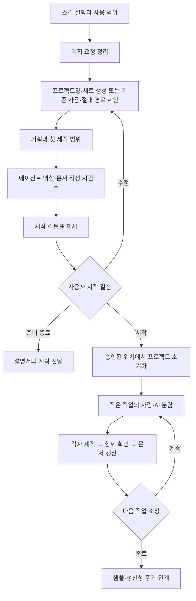

# 프로토타입 워크플로우 사용 설명서

## 이 스킬이 하는 일

게임 프로토타입을 만들기 전에 목적, 범위, 프로젝트 위치, AI 역할, 제작 순서, 문서 기록 방식을 함께 정리한다. 사용자가 시작할 프로젝트와 범위를 결정하면 그 절차에 따라 기획·제작·리뷰를 진행한다.

기본 방식은 **작업 분담 → 작은 결과 제작 → 함께 확인 → 다음 단위 조정**이다. 사용자는 기획·코드·씬·UI·조작감 등 원하는 부분을 직접 만들고, AI는 맡긴 구현·조사·검증·문서화를 지원한다. 분담은 작업에 맞춰 정한다.

AI 활용의 증거는 최초 요청이 어떤 결정과 제작 단계를 거쳐 실행물로 이어졌는지 보여주는 기록이다. 완성 기능, 실제 경과시간, 변경 대응 과정, 사람과 AI의 역할을 남긴다.

## 저장소 안의 위치와 사용법

- 스킬 이름: `prototype-workflow`
- 프로젝트 루트 기준 스킬 폴더: `Docs/Work-flow/prototype-workflow`
- 이 프로젝트의 지침은 이 저장소 사본을 기준으로 관리한다. 개인 설치판과 자동 동기화되지는 않는다.
- AI가 따르는 실행 지침: [SKILL.md](SKILL.md)
- 사용자가 읽는 설명서: 이 파일
- 시작 절차와 검토표: [startup-flow.md](references/startup-flow.md)
- 에이전트 역할과 제작 시퀀스: [orchestration.md](references/orchestration.md)
- 모델·Effort 배정과 다른 환경의 설정 방법: [model-routing.md](references/model-routing.md)
- 문서별 작성 책임: [documents.md](references/documents.md)
- 자동 기록 도구 사용법: [recording.md](references/recording.md)
- 확인된 도구/절차 검증: [VALIDATION.md](VALIDATION.md)

**이 폴더는 프로젝트와 함께 보관하는 스킬 문서 위치다. 게임 제작의 시작 여부와 범위는 별도로 결정한다.**

Git으로 프로젝트를 받은 뒤 이 설명서와 `SKILL.md`를 읽으면 된다. `$prototype-workflow` 호출은 사용 중인 환경에 스킬이 등록된 경우의 예시다. 등록되어 있지 않으면 AI에게 `Docs/Work-flow/prototype-workflow/SKILL.md를 읽고 현재 요청 범위에서 따라줘`라고 전달한다. 폴더 안의 `agents/openai.yaml`만으로 에이전트가 실행되는 것은 아니다.

## 먼저 준비하고, 그다음 시작한다

| 순서 | 사용자에게 보이는 것 | 이때 만들어지는 것 |
|---|---|---|
| 0. 스킬 이해 | 스킬 설명서·역할·전체 절차 | 스킬 문서와 도구 |
| 1. 요청 정리 | 만들려는 이유, 보여줄 경험, 제약, 기한 | 요청 요약 |
| 2. 대상과 위치 제안 | 프로젝트명, 새로 생성/기존 사용, 절대 경로 | 시작 검토표의 위치 항목 |
| 3. 기획·제작 구조 제안 | 대표 플레이, 첫 범위, 재사용, 단계별 완료 기준 | 기획·제작 계획 초안 |
| 4. 역할·문서 순서 확인 | 누가 무엇을 만들고 언제 기록하는지 | 작업 배정표·문서 지도 |
| 5. 시작 결정 | 시작할 대상, 경로, 범위, 첫 생성 파일이 보이는 검토표 | 사용자 시작 결정 기록 |
| 6. 프로젝트 시작 | 실제 생성/재사용 결과와 경로 안내 | 승인 범위의 프로젝트·문서·기록 |
| 7. 제작·리뷰·증명 | 실행물, 검증 결과, 생산성 기록 | 단계별 자동 문서 갱신 |

준비 중인 기획이나 A/B 선택만으로 프로젝트를 생성하거나 기존 프로젝트를 변경하지 않는다. “이 경로에서 이 범위로 시작”이 이미 정해졌다면 같은 결정을 다시 묻지 않는다.

## 전체 순서

## AI와 사람이 맡는 일

| 역할 | 맡는 일 | 결과 |
|---|---|---|
| 사용자 | 목표와 선택, 직접 맡은 기획·코드·씬·UI 제작, 플레이 조정 | 원하는 경험과 직접 만든 결과 |
| AI 파트너·기록 | 대안 설명, 합의된 조사·구현 지원, 검증과 문서 갱신 | 함께 확인할 작은 결과와 근거 |
| 조사·기획 | 레퍼런스와 현재 구현 조사, 기획 근거 정리 | 사실과 제안의 구분 |
| 제작 | 배정된 파일과 범위 구현 | 실행 가능한 결과와 변경 목록 |
| 독립 리뷰 | 요청과 실제 결과 비교, 필요한 검사 | 확인된 결과와 남은 항목 |

역할을 모두 동시에 실행하지 않는다. 독립적으로 나눌 일이 있을 때 필요한 에이전트를 배정한다. 총괄이 기록을 겸하므로 문서 담당을 항상 별도 실행할 필요는 없다.

메인 컨텍스트는 **Astra · Ultra**, 보조는 **자료 확인 Luna · Low / 제작 Terra · Medium / 복잡한 검토 Sol · High**로 배정한다. 보조는 최대 2개만 병행하고 필요한 문맥만 전달한다. 자동 보고서 생성에는 모델을 쓰지 않는다. 이 기준의 효과는 완료 결과와 재작업·실제 사용량으로 확인하며 절감률을 미리 주장하지 않는다.

[설정 템플릿](codex/config.toml)과 `codex/agents/`의 역할 파일은 Docs 안에 보관한다. 현재 활성 설정에 설치된 상태는 아니며, 다른 환경에서 적용할 때 기존 프로젝트 설정에 필요한 항목만 병합한다. [적용 경로와 확인 방법](references/model-routing.md)을 함께 읽는다.

## 실제 협업은 이렇게 진행한다

첫 발사 기능이라면 사용자가 씬 배치와 카메라·조준감을 맡고, AI가 합의된 발사 코드와 확인 방법을 맡을 수 있다. 실제 결과를 함께 보고 조작을 조정한 뒤 다음 기능으로 넘어간다. 이것은 분담 예시다. 사용자가 코딩을 맡거나 AI의 담당 범위를 줄일 수도 있다.

- 이번 목표: 함께 확인할 작은 결과 하나.
- 작업 분담: 사용자가 할 일, AI가 할 일.
- 확인 지점: 무엇을 보고 다음 작업을 정할지.

사용자 피드백에 달린 다음 기능은 먼저 대량 제작하지 않는다. 맡긴 단위 안의 사소한 구현은 AI가 진행하며 별도 허락을 매번 요구하지 않는다.

토큰과 시간을 아끼기 위해 현재 질문에 필요한 조사와 결과만 만든다. 에이전트는 독립 작업이나 중요한 리뷰에서 이익이 있을 때 사용하고, 문서는 결정·변경·검증을 기존 파일에 짧게 누적한다. 자동 문서화는 협업 기록을 남기는 역할이다.

## 문서는 언제 남는가

프로젝트 시작 전에는 검토에 필요한 요청·위치·역할·제작 순서를 설명한다. 특정 시작안을 파일로 저장할 때는 합의된 준비 문서 위치를 사용한다. 시작할 게임 폴더를 미리 만들어 문서부터 넣지 않는다.

프로젝트 시작 후에는 다음과 같이 기록한다.

| 발생한 일 | 바로 갱신할 문서 |
|---|---|
| 요청·제약 변경 | 요청서 BRIEF |
| 핵심 기획 결정 | 기획 원본 DESIGN 또는 기존 GDD |
| 제작 순서·담당 변경 | 제작 계획 PLAN |
| 작업 시작·결과물 생성 | 누적 이벤트와 자동 보고서 REPORT |
| 테스트·플레이·성능 확인 | REVIEW와 관련 증거 |
| 작업 종료·다음 작업 인계 | HANDOFF |

AI가 작업 중에 문서를 갱신하고 기록 도구를 호출한다. 사용자가 매번 “문서에 남겨줘”라고 지시하지 않아도 된다. 실행 중이 아닌 스킬이 사용자 작업을 상시 감시하지는 않는다.

## 자동으로 수집되는 정보와 사람이 판단할 정보

- 기록 도구: 호출 시각, 담당, 작업 ID, 연결 파일의 해시, 같은 작업의 시작~종료 경과시간, 보고서 생성.
- 작업 에이전트: 실제 작업 내용과 결과 요약, 검증 수준, 문서 갱신.
- 사용자: 중요한 선택과 직접 수행한 Editor/기기 확인 결과.

시간은 관측 경과시간이다. 휴식·대기와 병렬 작업을 순수 작업시간으로 바꾸지 않는다. 비교 기준이 없으면 “AI 덕분에 몇 배 빨라졌다”는 수치를 만들지 않는다.

## 사용 예시

**스킬과 절차만 준비할 때**

`$prototype-workflow 프로젝트를 시작하기 위한 흐름과 스킬 설명서, 에이전트 역할, 문서 작성 순서를 준비해줘. 아직 프로젝트는 생성하지 마.`

**특정 아이디어의 시작안을 검토할 때**

`$prototype-workflow 이 아이디어의 시작안을 정리해줘. 프로젝트명과 저장 위치를 먼저 제안하고, 제작을 시작하기 전에 검토표를 보여줘.`

**경로와 범위가 결정되어 실제 시작할 때**

`$prototype-workflow 앞서 확인한 시작 검토표의 프로젝트 경로와 범위로 제작을 시작해줘.`

**이미 시작한 프로젝트를 이어갈 때**

`$prototype-workflow 이 프로젝트의 HANDOFF부터 확인하고, 승인된 범위 안에서 다음 작업과 자동 문서화를 이어가줘.`

## 준비 완료의 기준

사용자가 이 스킬의 역할을 이해할 수 있고, 시작 절차·담당·문서 순서·기록의 한계가 설명되어 있으며, 기록 도구가 격리된 시험에서 동작하면 준비가 완료된다. 실제 프로젝트 생성이나 플레이 빌드는 별도의 다음 단계다.
