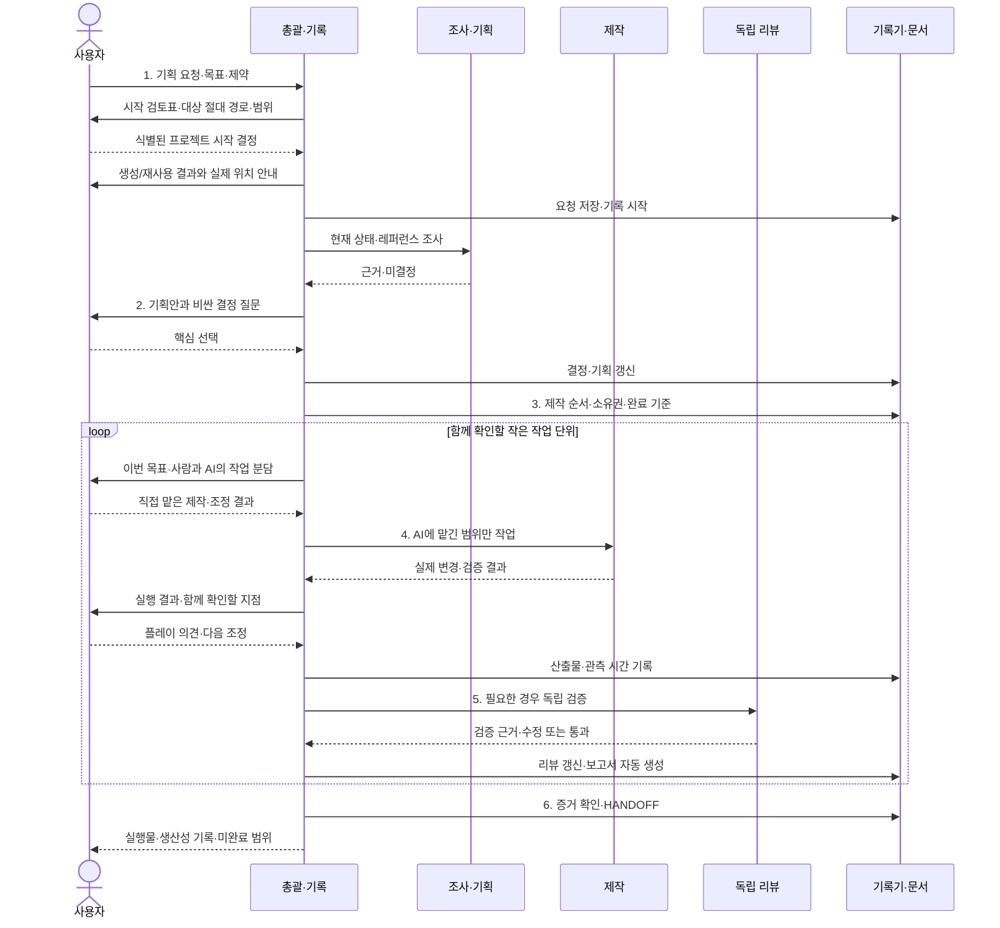

# 에이전트 역할과 실행 순서

역할은 재사용 가능한 작업 지침이다. 이름만 지정한 전용 모델/프로세스가 자동 설치되는 것은 아니다. 현재 환경의 delegation 도구로 필요한 역할을 할당하며 [모델·Effort 정책](model-routing.md)에 따라 두 값을 명시한다. Main Context는 Astra · Ultra, 자료 확인은 Luna · Low, 제작은 Terra · Medium, 복잡한 검토는 Sol · High로 시작한다. 에이전트 도구가 없으면 같은 책임을 순차 수행하며 병렬 실행이라고 기록하지 않는다.

## 준비 모드

프로젝트 시작 전에는 총괄이 설명서·시작 검토표·역할·문서 순서를 작성하고, 조사/리뷰 담당은 그 절차를 검토한다. 도구 시험은 격리된 임시 공간에 한정한다. 실제 게임 제작자를 배정하거나 후보 프로젝트에 문서·로그를 생성하지 않는다.

아래 제작 역할과 시퀀스는 사용자가 프로젝트 경로와 시작을 결정한 후 적용한다.

## 책임

먼저 사용자와 `사람이 만들 부분 / AI가 도울 부분 / 함께 확인할 결과`를 정한다. 아래는 AI 내부의 선택 가능한 역할이며 전체 제작 위임을 뜻하지 않는다. 사용자 작업과 피드백에 달린 구현을 먼저 배정하지 않는다.

| 역할 | 소유권 | 입력 | 반환 |
|---|---|---|---|
| 총괄·기록 | 요청, 기획 원본, PLAN, REVIEW 취합, HANDOFF, 증거 등록 | 사용자 요청·현재 파일·작업 결과 | 결정 경계, 작업 패키지, 통합 결과와 문서 |
| 조사·기획 보조 | 읽기 전용 조사와 지정된 검토 결과 | 레퍼런스·현재 코드·질문 | 사실/추론/미결정, 근거 경로 |
| 제작 | 명시적으로 배정된 코드·에셋 파일만 | 승인 범위·입출력 계약·완료 기준 | 변경 목록·테스트 출력·미실행 사항 |
| 독립 리뷰 | 지정 빌드·코드 읽기와 격리된 검증 | 요청·기획·실제 산출물 | 재현 가능한 발견, 검증 수준, 통과 범위 |

총괄은 문서 담당을 겸한다. 규모가 커질 때만 별도 기록 담당을 둔다. 코드를 보지 않은 기록 담당이 결과를 추측하지 않도록 모든 작업자가 증거를 반환한다.

역할이 존재한다고 매번 전부 실행하지 않는다. 보조 최대 2개, 전체 대화 복제 대신 필요한 파일·결정 요약만 전달, 하위 재위임 없음이 기본이다. 보고서 생성은 모델 없이 기록기를 호출한다.

## 필요한 경우의 병렬 작업 예시

- 준비: 총괄·기록 + 현재 프로젝트 조사 + 도구 제작. 독립 작업이 없으면 에이전트를 늘리지 않는다.
- 기획: 총괄이 사용자와 결정. 조사는 선행 사실을 제공한다. 문서상 미승인 범위의 구현을 병렬로 시작하지 않는다.
- 제작: 총괄·통합 + 게임 로직 + UI/표현. 공유 인터페이스는 총괄이 먼저 고정하고 공유 파일은 한 사람만 편집한다.
- 리뷰: 제작자 완료 뒤 다른 에이전트가 검증. 총괄은 실제 결과를 합치고 보고서를 갱신한다.
- 기록기는 짧은 호출로 실행한다. 로그 잠금은 동시 쓰기를 보호하며, 별도 영구 에이전트를 필요로 하지 않는다.

## 배정 메시지 양식

```text
작업 ID / 목표:
역할 / Model / Effort / 선택 이유:
문맥 전달 범위 (기본: 필요한 파일과 결정 요약만):
승인된 범위와 관련 문서:
소유 파일 또는 디렉터리:
읽어야 할 기존 구현/재사용 후보:
선행 작업과 공유 입출력 계약:
변경하면 안 되는 사용자 소유 자산:
검증 방법과 필요한 결과:
실패 시 중단 조건 / 상향 여부 (작업당 최대 한 번):
반환: 변경 경로, 수행한 검사/출력 경로, 미실행 검사, 다음 의존 작업.
기록: 배정 설정, 실제 확인된 실행 정보, 재작업 여부. 미제공 사용량은 추정하지 않는다.
추가 에이전트를 생성하지 않는다.
공유 작업 공간에서 다른 작업자의 변경을 되돌리지 말고 반영한다.
```

작은 작업은 사용자와 AI의 공동 확인 및 필요한 실행 검증으로 마무리한다. 변경 규모나 위험 때문에 독립 리뷰가 도움이 될 때만 별도 역할을 배정한다. 독립 리뷰에는 최초 요구, 실제 결과, 실행 제약을 제공한다.

## 시퀀스



사용자의 기획 결정이 이미 있으면 해당 문답을 생략하고 기존 결정 출처를 기록한다.

지원 형식 확인: [OpenAI 스킬 문서](https://learn.chatgpt.com/docs/build-skills), [서브에이전트 문서](https://learn.chatgpt.com/docs/agent-configuration/subagents). 실제 실행 가능 도구와 슬롯 수는 현재 세션을 우선한다.
